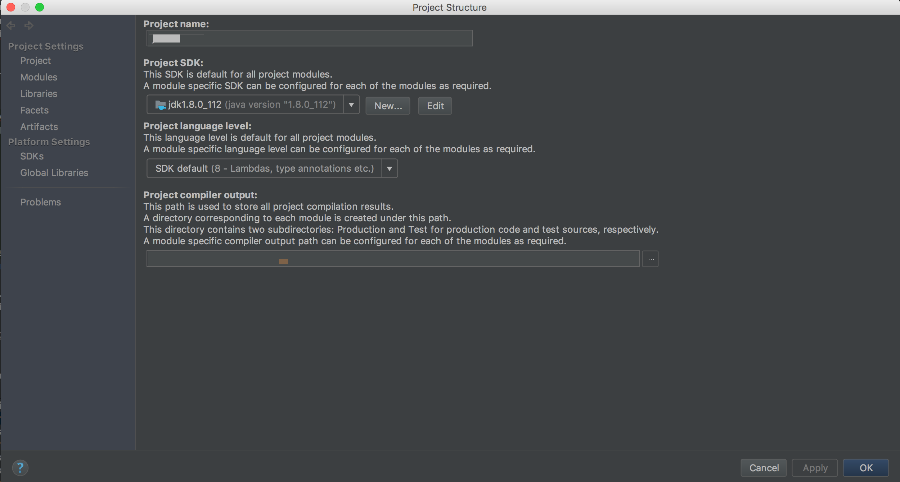
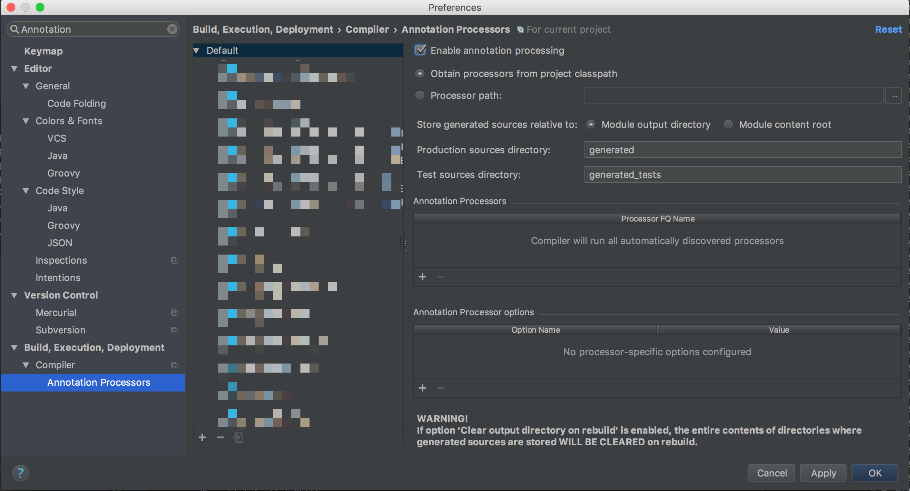
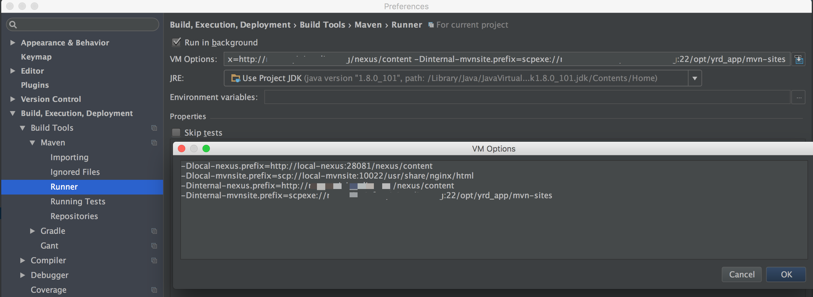
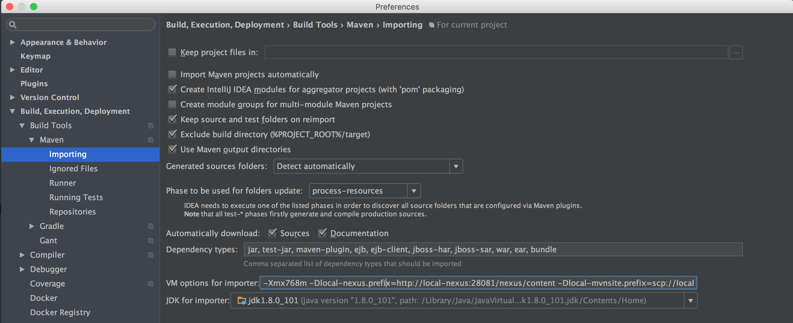

# maven-build

## IDE setup

  + IntelliJ         Lombok (And enable annotation processing)
  + IntelliJ&Eclipse Grep Console
  + [home1-oss/src/main/site/markdown/CODESTYLE.md](../home1-oss/CODESTYLE.html)

  + IntelliJ Maven runner and importing VM args

Note: These screenshots is only represents the location of the configuration.
